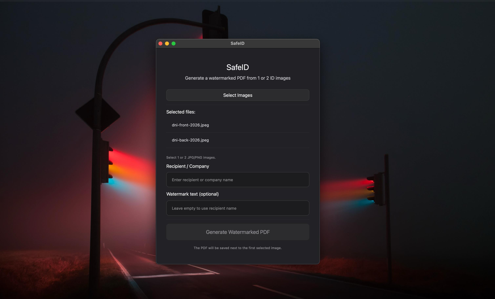
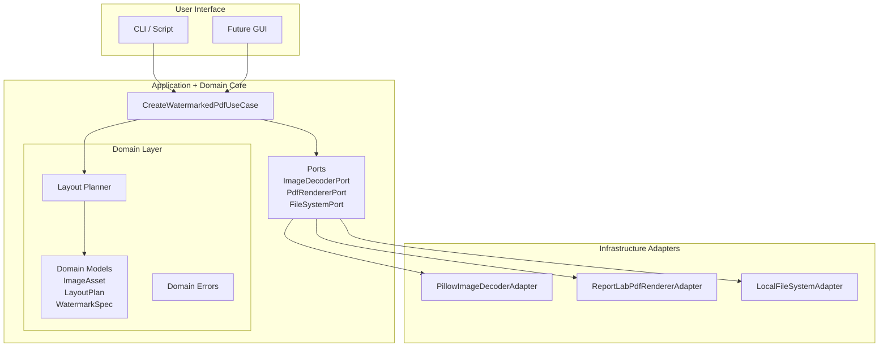

# SafeID




SafeID is a privacy-focused desktop application that generates watermarked PDFs from sensitive identity images such as passports or ID cards.

The application overlays a repeated watermark containing the recipient's name across the image area.
This helps discourage misuse if the document is leaked or shared without authorization.

## Table of Contents

- [Features](#features)
- [Privacy & Security](#privacy--security)
- [Running the application](#running-the-application)
    - [Option 1 - macOS app](#option-1--macos-app)
    - [Option 2 - Run from source](#option-2--run-from-source)
- [Development](#development)
    - [Running Tests](#running-tests)
    - [Formatting code](#formatting-code)
- [Project Architecture](#project-architecture)
- [Testing](#testing)
- [Packaging](#packaging)
- [Project Structure](#project-structure)
- [Roadmap](#roadmap)
- [License](#license)
- [Author](#author)


## Features

- Generate a watermarked PDF from 1 or 2 identity images
- Automatic A4 layout with proportional scaling
- Repeated diagonal watermark overlay
- Local processing only - no cloud uploads
- Clean hexagonal architecture
- Fully testable domain logic 
- Packaged as a macOS desktop application

## Privacy & Security

SafeID is designed to minimize the risk of identity document misuse.

Key design principles:

- No cloud processing - all operations happen locally
- No image storage - images are processed in memory
- Watermark discourages unauthorized use
- No metadata retention in generated documents

This makes the tool suitable for situations where you must share your identity documents but want to limit how they can be reused.


## Running the Application

### Option 1 -  macOS App

After building the application:  
```bash
dist/SafeID.app
```

Open the application and follow UI prompts.

### Option 2 - Run from Source

Clone the repository: 

```bash
git clone https://github.com/ciroalo/safeid.git
cd safeid
```

Create a virtual environment

```bash
python3 -m venv .venv
source .venv/bin/activate
```

Install dependencies:

```bash
pip install -e '.[dev]'
```

Run the application:

```bash
python3 -m safeid
```


## Development

### Running Tests

```bash
pytest
```

### Formatting code

```bash
black .
ruff check
```

###  Possible errors

It can be that your project doesn't find the `src/` folder, for that you just have to add:
```bash
PYTHONPATH=src
```
at the start of each of your commands.


## Project Architecture

SafeID follows a **hexagonal architecture** to separate business logic from infrastructure and UI concerns.



### Core Layers

**Domain:** 

- business rules
- layout planning
- watermark configuration

**Application:**

- use cases
- orchestration of domain logic

**Ports:**

- interfaces defining infrastructure dependencies

**Adapters:**

- pillow image decoding
- reportlab pdf rendering
- filesystem interaction


**UI:**

- PySide6 (Qt) interface

Architecture documentation can be found here:
[doc](doc/architecture/) or go directly to 

```bash
doc/architecture
```

## Testing

SafeID includes several types of tests:

**Unit Tests:**

Tests domain logic such as:

- layout planning
- image validation
- watermark configuration

**Integration Tests:**

Validate the full processing pipeline (happy path and errors)

Run all tests:

```bash
pytest
```

## Packaging

SafeID can be packaged as a macOS application using **Pyinstaller**.

Build the app bundle:

```bash
./scripts/build_macos.sh
```

This produces:

```bash
dist/SafeID.app
```

## Project Structure

```bash
safeid/
│
├── src/safeid/
│   ├── core/          # Domain logic
│   ├── adapters/      # Infrastructure implementations
│   ├── ui/            # Qt interface
│   └── app/           # Application wiring
│
├── tests/
│   ├── unit/
│   └── integration/
│
├── docs/
│   └── architecture/
│
├── scripts/
│
└── pyproject.toml
```

## Roadmap

Potential future improvements:

- pdf preview in the UI
- OCR detection of sensitive fields
- automatic redaction of selected attributes


## License

MIT License

## Author

Ciro Alonso
