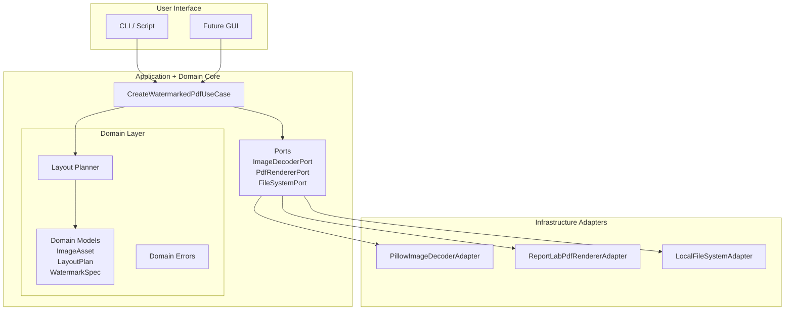

# Architecture Overview

## Purpose

SafeID is a local-first application that generates watermarked PDFs from sensitive
identity images (passport, ID card, etc.). The goal is to reduce the risk of misuse
if the images leak by embedding a visible watermark.

The system is designed with strong privacy guarantees:

- No cloud uploads
- No persistent storage or input images
- Deterministic local processing
- Minimal metadata handling

---

## Architectural Style

SafeID uses **Hexagonal Architecture (Ports and Adapters)**.

Core business logic is isolated from infrastructure concerns such as:

- image decoding
- PDF rendering
- filesystem access

This allows the domain logic to remain stable while adapters can evolve independently.

---

## High-Level Components

```bash
User Interface (CLI / GUI / Script)  
        │  
        ▼
Application Layer
(CreateWatermarkedPdfUseCase)
        │
        ▼
Domain Layer
(models, layout planner, domain errors)
        │
        ▼
Ports (Interfaces)
        │
        ▼
Adapters (Infrastructure)
 ├─ PillowImageDecoderAdapter
 ├─ ReportLabPdfRendererAdapter
 └─ LocalFileSystemAdapter
```
---

## Component Responsibilites

### Use Case
`CreateWatermarkedPdfUseCase`

Coordinates the workflow:

1. Validate request
2. Decode images
3. Compute layout
4. Render PDF
5. Export file

---

### Domain Layer

Contains pure business logic:

- Layout Planning
- Geometry calculation
- Domain models
- Domain errors

No external dependencies.

--- 

### Ports

Interfaces that define required infrastructure capabilites.

Examples:

- `ImageDecoderPort`
- `PdfRendererPort`
- `FileSystemPort`

---

### Adapters

Concrete implementatios of ports.

| Adapters | Responsibility |
|------|------|
| PillowImadeDecoderAdapter | Load and normalize JPG/PNG images |
| ReportLabPdfRendererAdapter | Render final A4 PDF |
| LocalFileSytemAdapter | Safely export generated file |

---

## Composition Root

Dependency wiring occurs in:

`safeid/app/container.py`

This ensures the domain layer never directly imports infrastructure code.

---

## Data Flow

```bash
Image files
    │
    ▼
ImageDecoderPort
(PillowImageDecoderAdapter)
    │
    ▼
ImageAsset (domain model)
    │
    ▼
LayoutPlanner
    │
    ▼
LayoutPlan
    │
    ▼
PdfRendererPort
(ReportLabPdfRendererAdapter)
    │
    ▼
PDF bytes
    │
    ▼
FileSystemPort
(LocalFileSystemAdapter)
    │
    ▼
Exported PDF
```

---

## Testing Strategy

The project uses multiple testing layers.

### Unit Tests

Tests isolated logic:

- layout planning
- adapters 
- use case validation

### Integration Tests

Verify end-to-end functionality using real adapters. Tests happy path along with errors.

### Demo Script

`scripts/run_demo.py` allows manual testing of the full pipeline.


---

## Future Extensions

The architecture supports future features without major refactoring:

- OCR-based field detection
- Automatic redaction
- GUI interface
- macOS packaging

---

## Hexagonal Architecture Diagram



The hexagonal architecture ensures that business logic remains isolated
from infrastructure concerns such as image decoding, PDF rendering,
and filesystem access.

## Data Flow Diagram

```mermaid
flowchart LR

Input["Image Files"]

Decoder["PillowImageDecoderAdapter"]

Asset["ImageAsset"]

Planner["Layout Planner"]

Plan["LayoutPlan"]

Renderer["ReportLabPdfRendererAdapter"]

PDF["PDF Bytes"]

FS["LocalFileSystemAdapter"]

Output["Exported PDF"]

Input --> Decoder
Decoder --> Asset
Asset --> Planner
Planner --> Plan
Plan --> Renderer
Renderer --> PDF
PDF --> FS
FS --> Output
```

